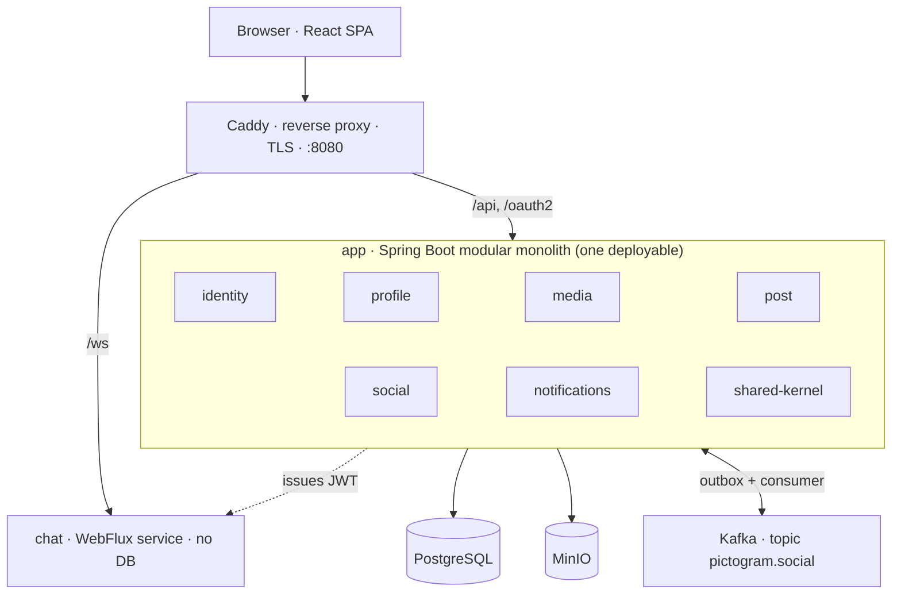

# Pictogram

An Instagram-like portfolio app — image posts, a follow graph, a feed, likes, comments,
notifications, and live 1:1 chat — built as a **modular monolith** (React 19 + Spring
Boot 4 / Java 25) to practise DDD and TDD, with [Claude Code](https://claude.com/claude-code).
It runs publicly at **[pictogram.imshy.me](https://pictogram.imshy.me)**.

Architecture is in [`CONTEXT-MAP.md`](./CONTEXT-MAP.md) and [`docs/adr/`](./docs/adr/);
build details in [`backend/README.md`](./backend/README.md) and
[`frontend/README.md`](./frontend/README.md).

## What's built

A component view — the Spring Modulith modules inside the one deployable, the separate
`chat` service, and the infrastructure behind them:



**Modules in the monolith** — each a bounded context with its own schema, published
interface, and `CONTEXT.md` glossary (contexts reference each other by ID only):

- **`identity`** — Google OIDC sign-in (backend-driven), then Pictogram's own ES256 access
  + rotating refresh tokens (ADR-0004).
- **`profile`** — username, display name, bio; the onboarding step that first creates a
  profile.
- **`media`** — uploaded images re-encoded server-side to one canonical square JPEG +
  thumbnail (ADR-0006), bytes in MinIO; orphan collection.
- **`post`** — one image plus an optional caption, published by an author; immutable,
  delete-only.
- **`social`** — the follow graph, the fan-out-on-read feed behind a port (ADR-0003),
  likes, and comments; four `internal/` sub-domains in one module (#128, #137).
- **`notifications`** — the in-app notification list, fed by the one Kafka-externalised
  flow out of `social`: `PostLiked` / `PostCommented` / `UserFollowed` relayed through a
  JPA outbox onto `pictogram.social` and stored recipient-keyed (ADR-0015). Read API done
  (#198); SPA bell pending (#199).
- **`shared-kernel`** — the one whitelisted dependency: ID value types and the cross-cutting
  HTTP edge conventions (Problem Details, pagination, current-user resolution, ADR-0008).
  No domain behaviour.

**Separate service and infrastructure:**

- **`chat`** — live 1:1 messaging and on-request presence, a separate Spring WebFlux
  service with its own Gradle build and image (ADR-0014). No database; a message is
  delivered live or not at all. It knows a caller only by the `UserId` in a verified
  Pictogram JWT.
- **Caddy** — the sole published entrypoint (`:8080`), terminates TLS in production, routes
  `/ws` to `chat` and everything else to `app` (ADR-0012).
- **PostgreSQL** — one schema per module, Flyway migrations per module (ADR-0009).
- **MinIO** — S3-compatible blob store for media bytes.
- **Kafka** — carries the single externalised event flow (`social` → `notifications`);
  every other integration is a synchronous published-interface call or an in-process event
  (ADR-0002, ADR-0015).

The frontend is a React SPA — feed cards composed client-side from batched calls, no BFF
(ADR-0005) — served as static resources from the `app` jar in container mode, and talking
to `chat` directly over a WebSocket (message dock + follow-list rail, #202–#204).

## How to run it

### Prerequisites

- **Docker** (Compose v2) — for the full stack and the Testcontainers-backed tests.
- A JDK on `PATH` — only to launch Gradle; the Java 25 toolchain is provisioned
  automatically.
- **Node 24** + Corepack (`corepack enable`) — only for host frontend development.
- Optional: [go-task](https://taskfile.dev) for the shortcuts used below.

### Quick start — whole stack in containers

```bash
cp .env.example .env    # gitignored; configures compose.yaml
task up                 # build + start postgres, minio, kafka, app, chat, caddy
task seed               # load a fixed 5-persona demo dataset
```

Open <http://localhost:8080> and sign in as **`alice`** (any username works — `task up`
bundles a mock Google, so no account is needed). `backend/Dockerfile` is a three-stage
build: it compiles the SPA, bundles it into the Spring Boot jar as static resources, and
runs on the `prod` profile.

```bash
docker compose -f compose.yaml down --remove-orphans      # stop           (task down)
docker compose -f compose.yaml down -v --remove-orphans   # stop + wipe data
```

To use real Google instead of the mock, run `task up:google` with `GOOGLE_CLIENT_ID` /
`GOOGLE_CLIENT_SECRET` in `.env` — create an OAuth 2.0 "Web application" client with
redirect URI `http://localhost:8080/login/oauth2/code/google`.

### Local development — apps on the host

Infra in containers, the apps on the host with hot reload:

```bash
docker compose -f compose.dev.yaml up -d   # postgres + minio + kafka + mock-oauth  (task dev)
cd backend  && ./gradlew :app:bootRun      # local profile auto-starts that infra   (task backend)
cd frontend && pnpm install && pnpm dev    # Vite proxies /api, /oauth2, /login/oauth2  (task frontend)
cd chat     && ./gradlew bootRun           # own Gradle build, needs no infra        (task chat)
```

In IntelliJ, running the app picks up the `local` profile and starts the infra itself —
see `backend/README.md`.

[`Taskfile.yml`](./Taskfile.yml) has every shortcut; `task --list` prints them.

## CI/CD

`.github/workflows/ci.yml` is **on-demand only** — the "Run workflow" button, never on a
PR or push (Actions-minutes budget). A manual run does the full sweep: backend
`./gradlew check` (Modulith `verify()`, unit + `@ApplicationModuleTest` + `@Tag("fast")`
scenarios, `openapi.json` drift), `chat`'s own `./gradlew check` (separate build), the
frontend lint / typecheck / test / build, the visual-regression suite, and the `blackbox`
job (backend `@Tag("blackbox")` tests including a real `chat` WebSocket handshake through
Caddy, plus the Playwright journeys).

Nothing runs on push, so the everyday gate is local: `./gradlew check` (backend and chat),
`pnpm test` / `pnpm lint` / `pnpm typecheck`, and `task test:blackbox` before a merge or
deploy. `main` is protected by the **"Main security"** ruleset (PR-only, no force-push or
deletion, linear history); with no required status checks, merging isn't gated on a green
run — trigger CI yourself when a change warrants it.

**Deployment.** The public instance at
[pictogram.imshy.me](https://pictogram.imshy.me) runs on a single VPS — the compose
topology behind Caddy, which terminates TLS for the domain (ADR-0012). `compose.prod.yaml` overlays
`compose.yaml` to pull `app`/`chat`/`caddy` images from GHCR instead of building them. The
**Deploy** workflow (`.github/workflows/deploy.yml`) is on-demand — it builds, pushes, and
rolls the box. `scripts/deploy/wizard.sh` walks the one-time box, DNS, and OAuth-client
setup. First-deploy sequence, edge rate-limit numbers, DNS and OAuth records, rollback,
and secret rotation are in [`docs/runbook/deployment.md`](./docs/runbook/deployment.md).

## Tests

All work here is test-first (ADR-0007), and the suite leans on **real infrastructure over
mocks**: Testcontainers starts Postgres, MinIO, and Kafka for the backend tests, so
persistence, Flyway migrations, S3 access, and the Kafka outbox are all exercised for real
under the `test` profile. Nearly every backend test is an integration test.

### Spring profiles

| Profile | Where | Datasource | Notes |
|---|---|---|---|
| `local` | host dev (`bootRun`, IntelliJ) | `localhost:5432` | starts `compose.dev.yaml` infra; verbose actuator |
| `test`  | automated tests | Testcontainers | plain-text logs; defined in `:test-support` |
| `prod`  | `compose.yaml` / any container | `PICTOGRAM_DB_*` env | minimal actuator exposure |

### Layers

- **Unit + `@ApplicationModuleTest`** — every module has slice coverage; `verify()` fails
  the build on any boundary violation.
- **`*Scenarios` user journeys** — written once, run two ways: in-process (`@Tag("fast")`)
  and black-box (`@Tag("blackbox")`) through `ContainerDriver` over HTTP against the built
  image, with `compose.mock-oauth.yaml` standing in for Google.
- **Playwright browser journeys** — mirror the scenario set through the real SPA.
- **Visual regression** — `pnpm test:visual` screenshots `/ui`, `/login`, and every screen
  at ~375 and ~1440 px against a bare Vite server.

A flaky failure anywhere is a defect, never a retry — Playwright is `retries: 0`, the
Gradle suite has none.

```bash
task test            # everything
task test:blackbox   # build + start the stack, run backend blackbox + Playwright, tear down
task test:e2e        # Playwright only

cd backend  && ./gradlew build                     # backend + module-boundary check
cd backend  && ./gradlew build -PincludeBlackbox   # + blackbox scenarios vs a running `task up`
cd frontend && pnpm test                           # frontend unit
cd frontend && pnpm test:e2e                       # Playwright vs a running `task up`
```

## License

[MIT](./LICENSE).
